# Ordered overlapping hierarchy

Library for modeling [overlapping hierarchy](https://en.wikipedia.org/wiki/Hierarchy#Degree_of_branching), in which nodes can have multiple parents and children are ordered.

Equivalent of [transitively reduced](https://en.wikipedia.org/wiki/Transitive_reduction#In_directed_acyclic_graphs) [weighted](https://en.wikipedia.org/wiki/Graph_(discrete_mathematics)#Weighted_graph) [directed acyclic graph](https://en.wikipedia.org/wiki/Directed_acyclic_graph), in which edges represent parenthood and their weights represent order.

```mermaid
graph TD
  Grandfather((👴)) & Grandmother((👵)) & University[🏫] --> Father((👨))
  Mother((👩)) & Father(👨‍🏫) --> Daughter(👧) & Son((👦))
  Daughter((👧)) --> Hamster((🐹))
  Daughter((👧)) & Son((👦)) --> Game{🎮}
  Son((👦)) --> Car{🏎️} & Train{🚂}
  Cat((🐈))
  Dog((🐕))
```



## Example

```text
A  B F  G
 \ | | /
   C H
 / | | \
D  E I  J
```

```typescript
const hierarchy = new OverlappingHierarchy()
hierarchy.add('A')
hierarchy.add('B')
hierarchy.attach('A', 'C')
hierarchy.attach('B', 'C')
hierarchy.attach('C', 'D')
hierarchy.attach('C', 'E')
hierarchy.add('F')
hierarchy.add('G')
hierarchy.attach('F', 'H')
hierarchy.attach('G', 'H')
hierarchy.attach('H', 'I')
hierarchy.attach('H', 'J')
```

## API

### Initialization

`const empty = new OverlappingHierarchy()`

`const cloned = new OverlappingHierarchy(source)`

### Mutation

`hierarchy.attach(node) // hierarch`
`hierarchy.attach(node, parent) // child`
`hierarchy.attach(node, parent, index) // child at index`

`hierarchy.detach(node, parent)`

`hierarchy.delete(node)`

### Traversal

`hierarchy.children() // hierarchs`
`hierarchy.children(node)`

`hierarchy.descendants() // all nodes`
`hierarchy.descendants(node)`

`hierarchy.parents(node)`

`hierarchy.ancestors(node)`

### Errors

### LoopError

```typescript
hierarchy.attach('A', 'A') // LoopError: Cannot add node to itself
```

### CycleError

```typescript
hierarchy.attach('D', 'A') // CycleError: Cannot add ancestor as a child
```

### TransitiveReductionError

https://en.wikipedia.org/wiki/Transitive_reduction#In_directed_acyclic_graphs

```typescript
hierarchy.attach('A', 'D') // TransitiveReductionError: Cannot attach non-child descendant as a child
hierarchy.attach('A', 'B') // TransitiveReductionError: Cannot attach child whose descendant is a child of the parent
```
